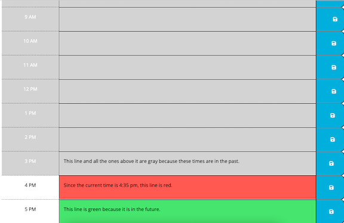

# Work-Day-Scheduler

* This is a daily schedule application that allows the user to save events for each hour of the work day. This app will run in the browser and feature dynamically updated HTML and CSS powered by jQuery and Moment.js.

## Deployed Site

* [Work Day Scheduler] (https://lesliejpatino.github.io/work-day-scheduler/)

## Built With

* [HTML]
* [CSS]
* [Javascript]
* [jQuery]
* [Moment.js]

## Demo

## Authors
* **Leslie Patino**

- [My GitHub] (https://github.com/lesliejpatino)
- [My LinkedIn] (https://www.linkedin.com/in/lesliejpatino/)
